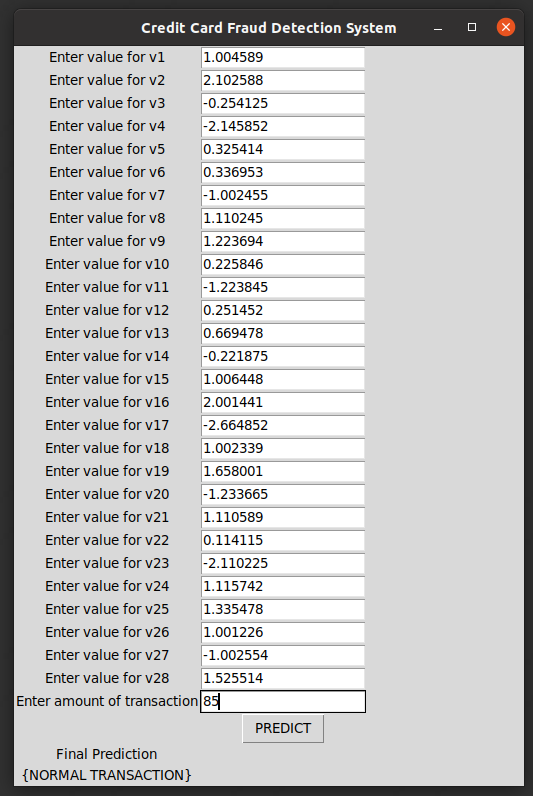

# Fraud_Detection_Credit_Card

Banking frauds have risen to a great extent over the past few years. The most common fraud occurs with the credit cards. It is a concerning issue for both banks and customers as it may result in financial loses for both and banks may lose their credibility. Machine Learning can help banks by detecting the fraudlent trasnactions and taking necessary actions immediately. It reduces the time-consuming manual reviews and hefty fees related to denial of legitimate transactions.  

This jupyter notebook is designed to predict a transaction as a <b><i>normal</i></b> or a <b><i>fraud</i></b> transaction based on a series of values. The data is preprocessed before analysis using pandas and numpy. Machine learning models are used for the detection.

The models used in the notebook include:

1. <b>Logistic Regression</b>: the logistic model is a statistical model that models the probability of an event taking place by having the log-odds for the event be a linear combination of one or more independent variables.

2. <b>Decision Tree Classifier</b>: The intuition behind Decision Trees is that you use the dataset features to create yes/no questions and continually split the dataset until you isolate all data points belonging to each class.

3. <b>Random Forest Classifier</b>: A random forest is a meta estimator that fits a number of decision tree classifiers on various sub-samples of the dataset and uses averaging to improve the predictive accuracy and control over-fitting.

4. <b>KNN Classifier</b>: In k-NN classification, the output is a class membership. An object is classified by a plurality vote of its neighbors, with the object being assigned to the class most common among its k nearest neighbors (k is a positive integer, typically small). If k = 1, then the object is simply assigned to the class of that single nearest neighbor.

The graphs for analysis are plotted using <b>Matplotlib</b>, <b>Plotly</b> and <b>seaborn</b>. It is a Python data visualization library based on matplotlib. It provides a high-level interface for drawing attractive and informative statistical graphics.

The GUI for the model is built using Tkinter library. Tkinter is the standard GUI library for Python. Python when combined with Tkinter provides a fast and easy way to create GUI applications. Tkinter provides a powerful object-oriented interface to the Tk GUI toolkit.

The dataset used in this notebook can be found at https://drive.google.com/file/d/1WFMcTnMykqyF9kNOIiM8g64pqKDQMAuH/view?usp=sharing

Libraries used:
* Pandas
* Numpy
* Seaborn
* Matplotlib
* Warnings
* Sklearn
* Plotly
* Joblib
* Tkinter

SKLearn models used:
* Logistic Regression
* Decision Tree Classifier
* Random Forest Classifier
* KNN Classifier

### Instructions to initialize the detector

The python notebook contains GUI implemented using the Tkinter library. 

The GUI works efficiently on Visual Studio Code. 

Download all the files from this repository along with the dataset. The dataset should be kept in the same folder with the IPYNB file.

Open the CCF.ipynb file in VSCode and run the last cell containing the GUI implementation.

Enter the values for V1-V28 and the amount column in the GUI window.

Click the predict button the get the decision on the transaction.

### GUI 

